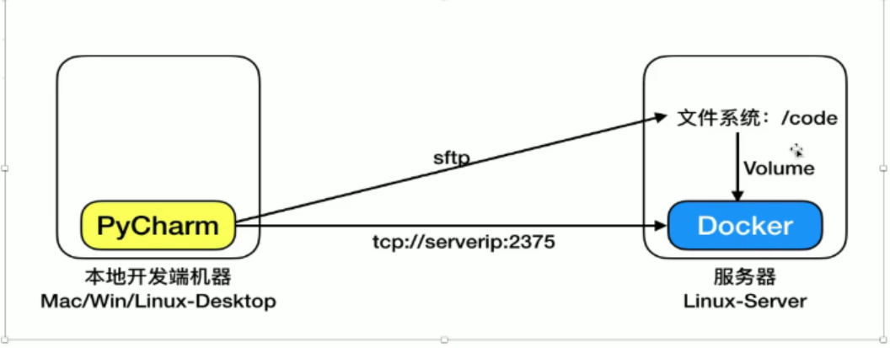
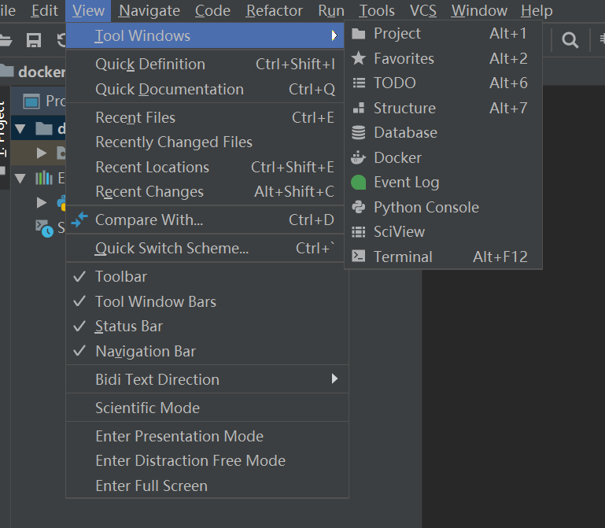
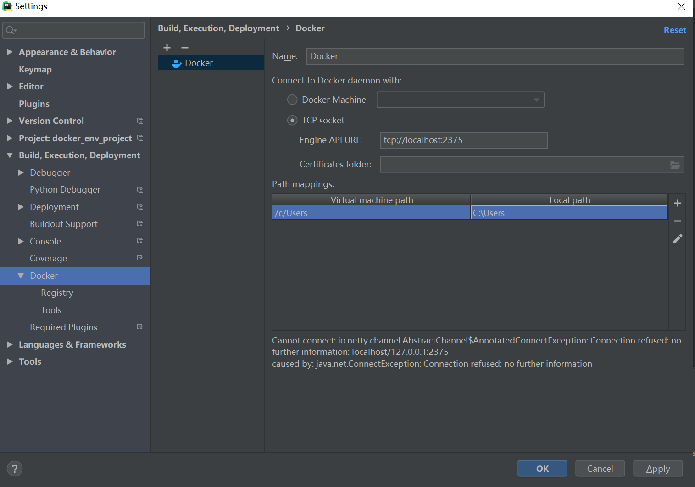
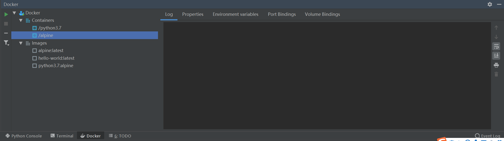
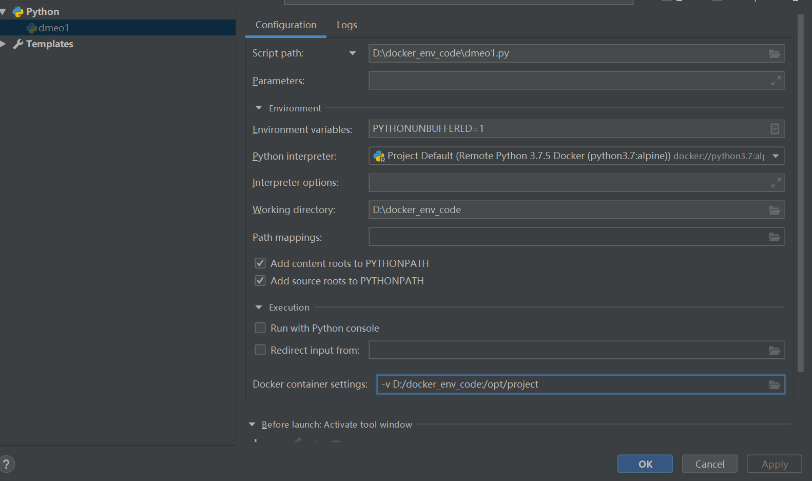
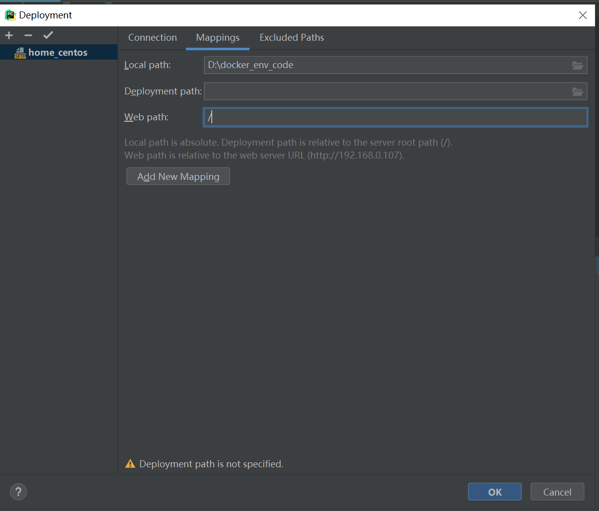
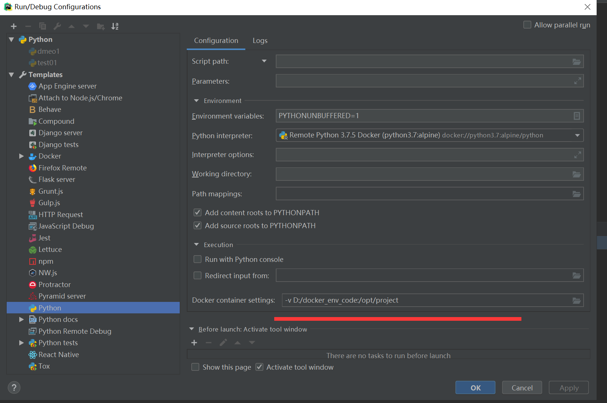

## 连接的原理

## 第一步，打开docker的连接

打开Docker配置选项

## 第二步，配置docker连接所需的参数

- Name：名称随便
- TCP Socket：远端连接服务器，把localhost该成远端的服务器的ip，**注意：连不上可能防火墙没打开**
- **这里有一个mapping配置，Virtual machine：虚拟机远程的路径，Local path指的是你本地开发的一个路径。这个很重要，在开发的时候，把你本地代码和远端的虚拟机映射是很重要的**

成功之后，可以操作容器和镜像

## 第三步，配置开发python的解释器

**看到左侧边的Docker选项，点击，然后可以看到在docker中可用镜像的python解释器（没有的直接去拉一个）**

**打开python解释器配置，看到docker container setting的配置D:/docker_env_code:/opt/project这里是俩个路径，一个是本地的路径，一个是远端的路径。这里看一下就行了。**

1.

2.

**然后配置deployment中的代码映射关系，这个是用来同步你本地和服务器代码之间的一个配置，记得把同步自动开启**

**最后，配置解释器默认的代码运行映射的位置**

