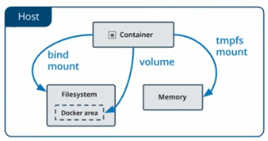

## 将Docker数据挂载到容器

在Docker中，要想实现数据的持久化（所谓Docker的数据持久化即***数据不随着Container的结束而结束***），需要将数据从宿主机挂载到容器中。目前Docker提供了三种不同的方式将数据从宿主机挂载到容器中：

　　（1）volumes：Docker管理宿主机文件系统的一部分，默认位于 /var/lib/docker/volumes 目录中；（**最常用的方式**）

　　目前所有Container的数据都保存在了这个目录下边，由于没有在创建时指定卷，所以Docker帮我们默认创建许多匿名卷。

　　（2）bind mounts：意为着可以存储在宿主机系统的任意位置；（**比较常用的方式**）

　　但是，bind mount在不同的宿主机系统时不可移植的，比如Windows和Linux的目录结构是不一样的，bind mount所指向的host目录也不能一样。这也是为什么bind mount不能出现在Dockerfile中的原因，因为这样Dockerfile就不可移植了。

　　（3）tmpfs：挂载存储在宿主机系统的内存中，而不会写入宿主机的文件系统；（**一般都不会用的方式**）

　　三种方式的示意图如下所示：

## 操作

## bind mounts

利用docker run/create的参数为容器的挂载数据卷

方式1：

-v 宿主机文件或者文件夹的路径：容器中的文件或者文件夹路径

方式2：

--mount type=bind，src=宿主机文件或者文件夹的路径，dst=容器中的文件或者文件夹路径

注意：src指定的必须提前存在或者创建

## volumes最常使用

利用docker run/create为容器挂载数据卷

方式一: -v, --volume参数：

-V VOLUME-NAME:容器中的文件或者文件夹路径

方式二: --mount参数：

--mount type =volume, src=VOLUME-NAME, dst=容器中的文件或者文件夹路径

volume对象管理:

docker volume - 命令管理volume数据卷对象
docker volume create - 创建数据卷对象
docker volume inspect - 查看数据卷详细信息
docker volume Is - 查看已创建的数据卷对象
docker volume prune - 删除未被使用的数据卷对象
docker volume rm - 删除一个或多个数据卷对象

数据卷使用注意：

Docker的数据卷更多会是使用volumes方式来进行使用。使用时需注意:

- 如果挂载- - 个空的数据卷到容器中的一个非空目录中,那么这个目录下的文件会被复制到数据卷中。
- 如果挂载个非空的数据卷到容器中的一 个目录中,那么容器中的目录中会 显示数据卷中的数据。如果
    原来容器中的目录中有数据,那么这些原始数据会被隐藏掉。

这两个规则都非常重要,灵活利用第一个规则可以帮助我们初始化数据卷中的内容。 掌握第二个规则可以
保证挂载数据卷后的数据总是你期望的结果。

## 共享其他容器的数据卷数据卷容器
利用docker run/create的--volumes-from参数指定数据卷容器

用法:
docker run/create --volumes-from CONTAINER