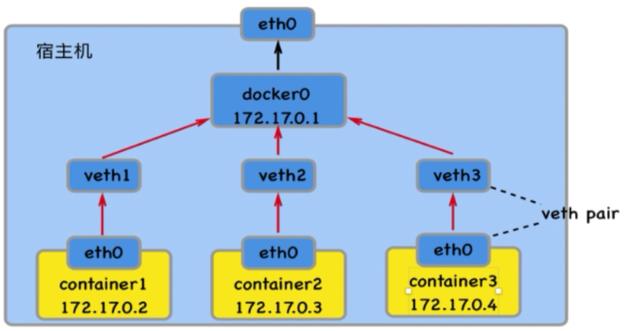

## Docker为什么需要网络管理

**容器的网络默认和宿主机，和其他容器都是相互隔离的。**

容器中可以运行一些网络应用（如nginx， web服务，数据库），如果需要外部也能访问这个容器内运行的网络应用，就需要配置网络。

## docker中网络模式

### bridge network（桥接模式）- 默认的网络模式



#### 特点:

- 宿主机上需要单独的bridge网卡,如默认docker默
    认创建的docker0。
- 容器之间、容器与主机之间的网络通信,是借助为每
    一个容器生成的一对veth pair虚拟网络设备对,进
    行通信的。一个在容器上，另一个在宿主机上。
- 每创建一个基于bridge网络的容器,都会自动在宿主
    机_上创建一个veth**虚拟网络设备。
    外部无法直接访问容器。需要建立端口映射才能访问。
- 容器借由veth虚拟设备通过如docker0这种bridge网
    络设备进行通信。
- 每一容器具有单独的IP

#### 端口映射


### host network（主机模式）- 容器和宿主机之间网络没有隔离，容器直接使用宿主机的网络

#### 特点:
- 容器完全共享宿主机的网络。网络没有隔离。
    宿主机的网络就是容器的网络。
- 容器、主机上的应用所使用的端口不能重复。
    例如:如果宿主机已经占用了8090端口,那
    么任何一个host模式的容器都不可以使用
    8090端口了;反之同理。
- 外部可以直接访问容器,不需要端口映射。
- 容器的IP就是宿主机的IP

### None network - 容器禁用所有的网络

### Overlay network（覆盖网络）- 利用VXLAN实现bridge模式

### Macvlan network 模式 - 容器具备Mac地址，使其显示为网路上的物理设备

## 网络管理的命令

### 列出网络

```bash
docker network ls
-----------------------------------------
NETWORK ID          NAME                DRIVER              SCOPE
bce41bdb9a44        bridge              bridge              local
b0edad9df1ba        host                host                local
12d424f6e8d8        none                null                local

```

### 创建网络(可以自定义)

```bash
docker network create [Options] NETWORK

Options:
      --attachable           Enable manual container attachment
      --aux-address map      Auxiliary IPv4 or IPv6 addresses used by Network driver (default map[])
      --config-from string   The network from which copying the configuration
      --config-only          Create a configuration only network
  -d, --driver string        Driver to manage the Network (default "bridge")
      --gateway strings      IPv4 or IPv6 Gateway for the master subnet
      --ingress              Create swarm routing-mesh network
      --internal             Restrict external access to the network
      --ip-range strings     Allocate container ip from a sub-range
      --ipam-driver string   IP Address Management Driver (default "default")
      --ipam-opt map         Set IPAM driver specific options (default map[])
      --ipv6                 Enable IPv6 networking
      --label list           Set metadata on a network
  -o, --opt map              Set driver specific options (default map[])
      --scope string         Control the network's scope
      --subnet strings       Subnet in CIDR format that represents a network segment

常用的创建：host，none网络只能存在一个，不能创建多个。overlay需要依赖swarm
docker network create -d 指定网络的模式 名称
```

## 删除网络

```bash
docker network rm nw [nw..]
```

## 查看网络的信息

```
docker network inspect
```

## 结合容器使用网络

#### 启动时候指定网络

```bash
docker run --network [网络名称] -dti centos bash
```

#### 连接和断开容器的网络

```bash
docker network disconnect [网络名称] [容器名]
docker network connect [网络名称] [容器名]
```


