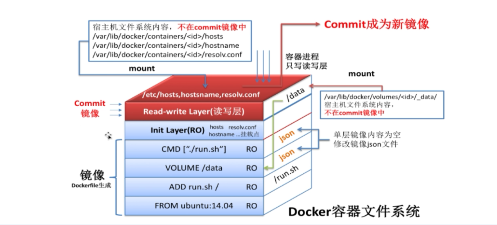

## 构建镜像的build命令

```bash
# 第一种，Dockerfile名称必须是Dockerfile
docker build Dockerfile文件的目录 -t 名称：标签
# 指定Dockerfile的文件目录。
docker build -f Dockerfile文件的目录 -t 名称：标签
```



## 命令

- FROM:指定基础镜像，如果本地没有这个镜像会自动pull
- RUN :构建镜像过程需要执行的命令。可以有多条。
- GMD :添加启动容器时需要执行的命令。多条只有最后一 条生效。可以在启动容器时被覆盖修改。
- ENTRYPOINT :同CMD ,但这个一定会被执行,不会被覆盖修改。
- LABEL :为镜像添加对应的数据。
- MAINTAINER :表明镜像的作者。将被遗弃,被LABEL代替。
- EXPOSE :设置对外暴露的端口。
- ENV :设置执行命令时的环境变量,并且在构建完成后,仍然生效
- ARG :设置只在构建过程中使用的环境变量,构建完成后,将消失。
- ADD :将本地文件或目录拷贝到镜像的文件系统中。能解压特定格式文件,能将URL作为要拷贝的文件
- COPY :将本地文件或目录拷贝到镜像的文件系统中。
- VOLUME :添加数据卷
- USER :指定以哪个用户的名义执行RUN, CMD和ENTRYPOINT等命令
- WORKDIR :设置工作目录

## 注意事项

Dockerfile镜像构建的的时候修改文件，在后面追加，前面的操作会读取缓存，在前面追加会重新操作一遍。